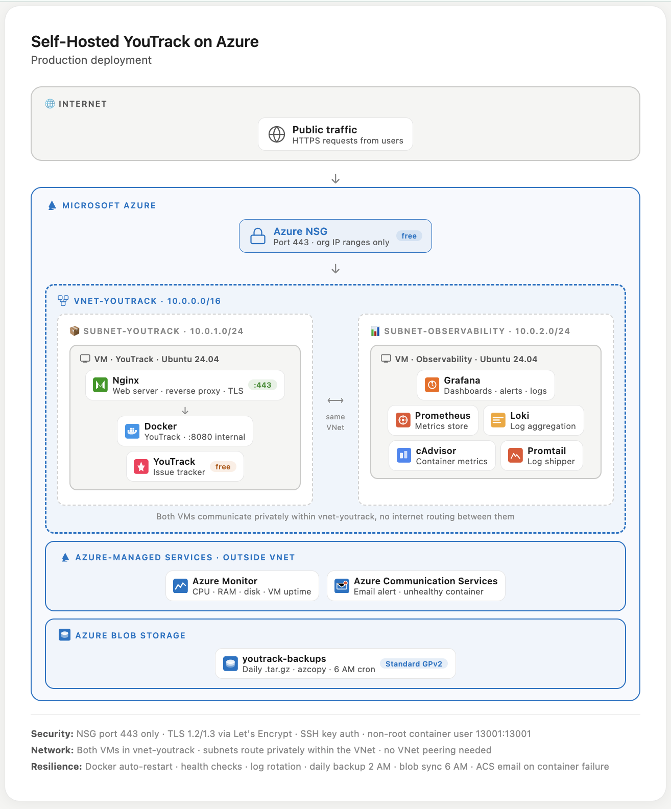

# 🚀 Self-Hosted YouTrack on Azure

> A production-ready deployment of [JetBrains YouTrack](https://www.jetbrains.com/youtrack/) on Azure using Docker, Nginx, Azure Blob Storage, Grafana, Prometheus, Azure Communication Service.

---

## Table of Contents

- [Architecture Overview](#architecture-overview)
- [Tech Stack](#tech-stack)
- [Prerequisites](#prerequisites)
- [Azure Resources Setup](#azure-resources-setup)
- [VM Configuration](#vm-configuration)
- [YouTrack Installation](#youtrack-installation)
- [Nginx Reverse Proxy](#nginx-reverse-proxy)
- [HTTPS / TLS Setup](#https--tls-setup)
- [Backup Strategy](#backup-strategy)
- [Resilience & Operational Measures](#resilience--operational-measures)
- [Observability & Monitoring](#observability--monitoring)

---

## Architecture Overview




---

## Tech Stack

| Component | Technology | Purpose |
|---|---|---|
| **Cloud** | Microsoft Azure | Hosting platform |
| **Compute** | Azure VM Ubuntu 24.04 LTS | Server hosting YouTrack |
| **Containerization** | Docker | Runs the YouTrack application |
| **Reverse Proxy** | Nginx | Web server, HTTPS/TLS termination, proxy headers |
| **Network Security** | Azure NSG | Restricts access to org IP ranges only |
| **Backup Storage** | Azure Blob Storage | Stores daily YouTrack backup archives |
| **Monitoring** | Azure Monitor + Alert Rules | VM-level metrics and alerting |
| **Observability** | Grafana + Prometheus | Dashboards, logs, container metrics |
| **Notifications** | Azure Communication Services | Email alerts on health failures |
| **License** | JetBrains YouTrack 10-user | No Application license required |

---

## Prerequisites

Before starting, ensure you have:

- An active **Azure subscription**
- A registered **domain name** (for HTTPS, it can be configured later)
- Your organisation's **public IP range(s)** for NSG rules
- A **JetBrains YouTrack license** (free up to 10 users, paid for 25+)
- A **GitHub account** (for this repo)

---

## Azure Resources Setup

### 1. Resource Group

Create a resource group to contain all YouTrack-related resources:

Azure Portal: **Resource Groups → Create**

---

### 2. Virtual Network

  name: vnet-youtrack or any name,
  address-prefix: 10.0.0.0/16
  subnet-name: snet-vm
  subnet-prefix: 10.0.1.0/24

---

### 3. Network Security Group (NSG)

Create the NSG and attach it to the subnet or select Basic during VM creation, this automatically attachs it to the subnet.

Add inbound rules in the NSG: depending on your use case

---

### 4. Virtual Machine

**Recommended spec for 10 users:**

| Setting | Value |
|---|---|
| Image | Ubuntu Server 24.02 LTS |
| Size | Standard_D2s_v3 (2 vCPU, 8 GB RAM) |
| OS Disk | Premium SSD, 128 GB |
| Public IP | Static |

> **Important:** The OS disk must be at least 128 GB because the YouTrack database (`/opt/youtrack/data`) lives on the local VM disk. NFS cannot be used for the database per JetBrains requirements.

---

### 5. Azure Blob Storage (Backups)
      Create your storage account

> The storage account networking should be set to **"Enable from selected virtual networks"** and add `vnet-youtrack / snet-vm`. Also add your office IP so you can browse it in the Azure Portal.

---

### 6. Log Analytics Workspace (for Azure Monitor)
      Create Log Analytic Workspace

---

## VM Configuration

### Install Docker

```bash
# Install dependencies
sudo apt-get update
sudo apt-get install -y ca-certificates curl gnupg

# Add Docker GPG key
sudo install -m 0755 -d /etc/apt/keyrings
curl -fsSL https://download.docker.com/linux/ubuntu/gpg | \
  sudo gpg --dearmor -o /etc/apt/keyrings/docker.gpg
sudo chmod a+r /etc/apt/keyrings/docker.gpg

# Add Docker repository
echo \
  "deb [arch=$(dpkg --print-architecture) signed-by=/etc/apt/keyrings/docker.gpg] \
  https://download.docker.com/linux/ubuntu \
  $(lsb_release -cs) stable" | \
  sudo tee /etc/apt/sources.list.d/docker.list > /dev/null

# Install Docker Engine
sudo apt-get update
sudo apt-get install -y docker-ce docker-ce-cli containerd.io \
  docker-buildx-plugin docker-compose-plugin

# Enable and start Docker
sudo systemctl enable docker
sudo systemctl start docker

# Allow current user to run docker without sudo
sudo usermod -aG docker $USER
newgrp docker
```

### Configure Docker Log Rotation

Prevents Docker container logs from filling up the VM disk:

```bash
sudo nano /etc/docker/daemon.json
```

```json
{
  "log-driver": "json-file",
  "log-opts": {
    "max-size": "50m",
    "max-file": "5"
  }
}
```

```bash
sudo systemctl restart docker
```

> This caps each container's logs at 50MB × 5 files = 250MB maximum per container.

### Install azcopy

Required for syncing backups to Azure Blob Storage:

```bash
wget -O azcopy.tar.gz https://aka.ms/downloadazcopy-v10-linux
tar -xvf azcopy.tar.gz
sudo mv ./azcopy_linux_amd64_*/azcopy /usr/local/bin/azcopy
sudo chmod +x /usr/local/bin/azcopy
azcopy --version
```

---

## YouTrack Installation

### 1. Create Local Directories

> ⚠️ **JetBrains requirement:** The `data` directory (Xodus database) must be on local disk. NFS is explicitly prohibited for database storage.

```bash
sudo mkdir -p -m 750 \
  /opt/youtrack/data \
  /opt/youtrack/conf \
  /opt/youtrack/logs \
  /opt/youtrack/backups

sudo chown -R 13001:13001 \
  /opt/youtrack/data \
  /opt/youtrack/conf \
  /opt/youtrack/logs \
  /opt/youtrack/backups
```

> YouTrack runs as non-root user `13001:13001` inside the container. The directories must be owned by this user ID before starting the container.

### 2. Pull the YouTrack Image

Check the latest version at [hub.docker.com/r/jetbrains/youtrack/tags](https://hub.docker.com/r/jetbrains/youtrack/tags):

```bash
docker pull jetbrains/youtrack:<version>
```

### 3. Run the YouTrack Container

```bash
docker run -d \
  --name vm-youtrack-prod \
  --restart unless-stopped \
  --health-cmd="curl -f http://localhost:8080/api/config || exit 1" \
  --health-interval=30s \
  --health-timeout=10s \
  --health-retries=3 \
  -v /opt/youtrack/data:/opt/youtrack/data \
  -v /opt/youtrack/conf:/opt/youtrack/conf \
  -v /opt/youtrack/logs:/opt/youtrack/logs \
  -v /opt/youtrack/backups:/opt/youtrack/backups \
  -p 8080:8080 \
  jetbrains/youtrack:<version>
```

**Flags explained:**

| Flag | Purpose |
|---|---|
| `-d` | Run in background (detached) |
| `--restart unless-stopped` | Auto-restart on crash or VM reboot |
| `--health-cmd` | Docker health check — marks container healthy/unhealthy |
| `-v` | Volume mounts — maps VM directories into container |
| `-p 8080:8080` | Expose port 8080 (Nginx proxies to this internally) |

### 4. Watch Startup Logs

```bash
docker logs vm-youtrack-prod --follow
```

Wait for: **"JetBrains YouTrack is running"**

### 5. Complete the Configuration Wizard

Get the one-time setup token:

```bash
docker logs vm-youtrack-prod | grep -i token
```

Open `http://<vm-public-ip>:8080` in your browser and complete the wizard:
1. Paste the one-time token
2. Set Base URL
3. Enter your YouTrack license key
4. Create the administrator account

---

## Nginx Reverse Proxy

### Install Nginx

```bash
sudo apt-get install -y nginx
```

### Update nginx.conf

Per JetBrains documentation, update worker settings:

```bash
sudo nano /etc/nginx/nginx.conf
```

Add/update these values:

```nginx
worker_rlimit_nofile 4096;    # Add before events block

events {
    worker_connections 2048;  # Update from default 768
}
```

### Create YouTrack Site Config

```bash
sudo nano /etc/nginx/sites-available/youtrack
```

The conf file is in the config folder in the repo
```

### Enable and Reload

```bash
sudo ln -s /etc/nginx/sites-available/youtrack /etc/nginx/sites-enabled/
sudo nginx -t
sudo nginx -s reload
```

### Update YouTrack Base URL

```bash
docker exec vm-youtrack-prod stop

docker run --rm -it \
  -v /opt/youtrack/conf:/opt/youtrack/conf \
  jetbrains/youtrack:<version> \
  configure --base-url=http://<your-domain-or-ip>

docker start vm-youtrack-prod
```

---

## HTTPS / TLS Setup

> Requires a domain name pointing to the VM's public IP via a DNS A record.

### Install Certbot

```bash
sudo apt-get install -y certbot python3-certbot-nginx
```

### Obtain SSL Certificate

```bash
# Temporarily allow port 80 from Any in NSG for Let's Encrypt validation
sudo certbot certonly --nginx -d youtrack.yourdomain.com
```

### Update Nginx Config for HTTPS

Replace the HTTP server block with:

```nginx
# Redirect HTTP to HTTPS
server {
    listen 80;
    server_name youtrack.yourcompany.com;
    return 301 https://$server_name$request_uri;
}

# HTTPS server block
server {
    listen 443 ssl http2;
    server_name youtrack.yourcompany.com;

    # SSL Certificate
    ssl_certificate /etc/letsencrypt/live/youtrack.yourcompany.com/fullchain.pem;
    ssl_certificate_key /etc/letsencrypt/live/youtrack.yourcompany.com/privkey.pem;

    # SSL Settings
    ssl_protocols TLSv1.2 TLSv1.3;
    ssl_prefer_server_ciphers off;

    # Security headers
    add_header Strict-Transport-Security "max-age=31536000" always;
    add_header X-Frame-Options SAMEORIGIN;
    add_header X-Content-Type-Options nosniff;

    # Max upload size
    client_max_body_size 10m;

    # Main proxy location
    location / {
        proxy_set_header X-Forwarded-Host $http_host;
        proxy_set_header X-Forwarded-For  $proxy_add_x_forwarded_for;
        proxy_set_header X-Forwarded-Proto $scheme;
        proxy_cache      off;
        proxy_buffers    8 64k;
        proxy_busy_buffers_size 128k;
        proxy_buffer_size 64k;
        client_max_body_size 10m;
        proxy_http_version 1.1;
        proxy_pass       http://localhost:8080;
    }

    # Live updates — buffering must always be off
    location /api/eventSourceBus {
        proxy_cache          off;
        proxy_buffering      off;
        proxy_read_timeout   86400s;
        proxy_send_timeout   86400s;
        proxy_set_header     Connection '';
        chunked_transfer_encoding off;
        proxy_set_header     X-Forwarded-Host $http_host;
        proxy_set_header     X-Forwarded-For  $proxy_add_x_forwarded_for;
        proxy_set_header     X-Forwarded-Proto $scheme;
        proxy_http_version   1.1;
        proxy_pass           http://localhost:8080/api/eventSourceBus;
    }

    # WebSocket for script debugger
    location /debug {
        proxy_set_header     X-Forwarded-Host $http_host;
        proxy_set_header     X-Forwarded-For  $proxy_add_x_forwarded_for;
        proxy_set_header     X-Forwarded-Proto $scheme;
        proxy_http_version   1.1;
        proxy_set_header     Upgrade $http_upgrade;
        proxy_set_header     Connection "upgrade";
        proxy_pass           http://localhost:8080/debug;
        proxy_pass_header    Sec-Websocket-Extensions;
    }
}
```

### Enable Auto-Renewal

```bash
sudo systemctl enable certbot.timer
sudo systemctl start certbot.timer
```

### Update YouTrack Base URL to HTTPS

```bash
docker exec vm-youtrack-prod stop

docker run --rm -it \
  -v /opt/youtrack/conf:/opt/youtrack/conf \
  jetbrains/youtrack:<version> \
  configure --base-url=https://youtrack.yourdomain.com

docker start vm-youtrack-prod
```

---

## Backup Strategy

Two complementary backup layers:

| Layer | Tool | What it protects |
|---|---|---|
| **Application** | YouTrack built-in backup → Azure Blob | Data corruption, deleted issues/projects, version rollback |
| **Infrastructure** | Azure VM Backup

### YouTrack Built-in Backup (UI)

Configure in YouTrack: **Administration → Server Settings → Database Backup**

| Setting | Value |
|---|---|
| Backup location | `/opt/youtrack/backups` |
| Archive format | TAR.GZ |
| Schedule | Daily at 2:00 AM |
| Files to keep | 7 |
| Notify on failure | Admin email |

### Daily Sync to Azure Blob (Cron at 6 AM)

See [`scripts/backup-youtrackdata-to-blob.sh`](scripts/backup-youtrackdata-to-blob.sh)

```bash
# Schedule — runs daily at 6 AM
# Add via: sudo crontab -e
0 6 * * * /path/to/file
```

> YouTrack creates the `.tar.gz` at 2 AM. The cron job syncs it to blob at 6 AM giving 4 hours buffer.

---

## Resilience & Operational Measures

### Docker Auto-Restart Policy

The `--restart unless-stopped` flag ensures YouTrack automatically restarts after a crash or VM reboot without manual intervention.

```bash
# Verify restart policy is set
docker inspect vm-youtrack-prod | grep -A3 RestartPolicy
```

### Container Health Checks

Docker periodically calls `/api/config` inside the container. If it fails 3 times consecutively the container is marked `unhealthy`.

```bash
# Check current health status
docker inspect --format='{{.State.Health.Status}}' vm-youtrack-prod
```

### Docker Log Rotation

Configured in `/etc/docker/daemon.json` — caps logs at 250MB per container (50MB × 5 files). See [VM Configuration](#vm-configuration).

### Nginx Log Rotation

Handled automatically by Ubuntu's `logrotate`. Verify:

```bash
cat /etc/logrotate.d/nginx
```

---

## Observability & Monitoring

### Azure Monitor

Enable VM Insights on the VM in Azure Portal:
**VM → Monitoring → Insights → Enable → Select Log Analytics Workspace**

### Azure Monitor Alert Rules

| Alert | Threshold | Severity |
|---|---|---|
| VM Availability | Any unavailability | Critical |
| CPU Percentage | > 85% for 5 min | Warning |
| Available Memory | < 500 MB | Warning |
| OS Disk Free Space | < 15% | Warning |

Alerts are sent via **Action Group** configured with team email addresses.

### Container Health Alert (Cron-based)

```bash
# Schedule — checks every 5 minutes
# Add via: crontab -e
*/5 * * * * /path/to/check-container-health.sh
```

### Grafana + Prometheus

Full observability stack planned using Docker Compose:

| Container | Purpose |
|---|---|
| Prometheus | Collects and stores metrics |
| Node Exporter | VM metrics (CPU, RAM, disk) |
| cAdvisor | Docker container metrics + health status |
| Loki | Log aggregation and storage |
| Promtail | Ships Nginx + YouTrack + Docker logs to Loki |
| Grafana | Dashboards, log search, alert rules |

---


## Quick Reference Commands

```bash
# View YouTrack logs
docker logs vm-youtrack-prod --follow

# Check container health
docker inspect --format='{{.State.Health.Status}}' vm-youtrack-prod

# Restart YouTrack
docker restart vm-youtrack-prod

# Check disk usage
df -h /opt/youtrack/

# Reload Nginx config
sudo nginx -t && sudo nginx -s reload

# Check Nginx error logs
sudo tail -f /var/log/nginx/error.log

# Check certificate expiry
sudo certbot certificates

# List YouTrack backup files
ls -lh /opt/youtrack/backups/
